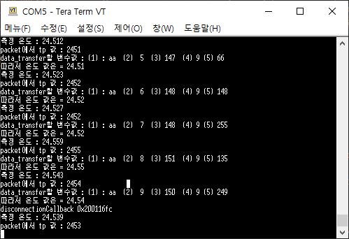

### 공개되어 있는 MAXREFDES101의 2.7버전 소스코드에 대해 수행한 리버스 엔지니어링 작업 내용입니다.
소스 코드 출처 : https://os.mbed.com/components/Health-Sensor-Board/

***

## Connection 까지 대략적인 flow

1. 블루투스 connection 시도 


2. watchInterface.BLE_Interface_Exists가 true로 바뀜


3. dsInterface.stopcommand() 호출해서 모든 sensor들을 중단
	
	stopcommand()함수 가보면, 모든 센서에 대해서 센서개수만큼 stop함수 호출함
	

4. watchInterface.BLE_Interface_Exists = BLE::Instance().gap().getState().connected;


5. if (watchInterface.BLE_Interface_Exists || watchInterface.USB_Interface_Exists) 


7. process_ble();

***

## Connection/Disconnection 확인을 위해, 연결 상태에 따른 LED 변경 추가

| Connection | Disconnection | 
|----|----------|
|    |          | 

프로젝트 수행 중, 왠만한 디버깅은 시리얼 통신을 통해 printf()출력을 확인할 수 있었음. 하지만, 그렇지 않은 경우에 대해 디버깅을 할 수 있어야 했음.
따라서 부착되어 있는 LED가 BLE 연결 상태에 따라 red/green으로 변경되도록 소스코드를 변경.

***

## 저젼력 블루투스(BLE)

기존 블루투스(2.0 or 3.0)과 달리 해당 개발키트는 4.0을 사용하고, 이를 BLE(Bluetooth Low Energy, 저전력 블루투스)라고 함.
기본적인 매커니즘은 기존의 블루투스는 항상 연결된 상태를 유지하는데에 비해, BLE는 적은 양의 데이터를 Advertising(Broadcasting)을 사용하여
일방적으로 송출하도록 함. 하지만 unidirectional communication이나, 많은 양의 데이터를 받으려면 예전과 같은 connection방식을 사용해야 함.


***

```c++
void writeCharCallback(const GattWriteCallbackParams *params)
{
	uint8_t data[BLE_READWRITE_CHAR_ARR_SIZE] = {0};
	/* Check to see what characteristic was written, by handle */
	printf("writeCharCallback %p\r\n", Thread::gettid());
	if(params->handle == writeChar.getValueHandle()) {
		printf("Data received: length = %d, data = 0x",params->len);
		for(int x=0; x < params->len; x++) {
			if ((BLE_DS_INTERFACE != NULL) && (params->data[x] != 0)) {
				BLE_DS_INTERFACE->build_command((char)params->data[x]);
			}
			printf("%x-", params->data[x]);
		}
		printf("\n\r");
	}
	/* Update the notifyChar with the value of writeChar */
	BLE::Instance(BLE::DEFAULT_INSTANCE).gattServer().write(writeChar.getValueHandle(), data, BLE_READWRITE_CHAR_ARR_SIZE);
}
```
writeCharCallback 함수에서 params값을 통해, device에서 어떤 센서값을 읽어야 하는지에 대한 command 문자열을 완성시킴.
그리고, build_command()를 호출한 뒤에 cmd_str 문자열값을 parse_command()에 넘겨주어서, 해당되는 기능(temp, ecg, ppg)을 호출

***

## Send part(peripheral -> central)

```c++
int BLE_Icarus_AddtoQueue(uint8_t *data_transfer, int32_t buf_size, int32_t data_size) {
	int ret = 0;
	//printf("size is: %d\r\n", size);
	// TODO: Append a known character to the byte array in case size is
	// less than 20 bytes
	while ((data_size % BLE_NOTIFY_CHAR_ARR_SIZE) && data_size < buf_size)
		data_transfer[data_size++] = 0;
	mxm_assert_msg(!(data_size % 20), "BLE packet size must be multiple of 20 bytes");

	while(data_size > 0){
		ret = enqueue(&BLEQUEUE, data_transfer);
		data_size -= BLE_NOTIFY_CHAR_ARR_SIZE;
		data_transfer += BLE_NOTIFY_CHAR_ARR_SIZE;
	}

	if(ret != 0)
		printf("BLE_Icarus_AddtoQueue has failed\r\n");

	return ret;
}
```
여기서 salve(peripheral)가 master(central)에게 데이터를 전송. 
찾아보면 여러 센서 소스 코드(dsinterface, ecgcomm, sensorcomm, tempcomm)에서 해당 함수를 호출함.

***


## BLE communication command set

Read/write characteristic을 통해서 값을 측정하고자 하는 센싱 정보와 측정 세팅정보를 문자열(string command) 아스키 코드값으로 client에서 server로 전달하면
server에서는 먼저 write 이벤트 발생시 수행되어지는 callback 함수 writeCharCallback()를 호출함.

writeCharCallback()함수에서는 '\n'또는 '\r'에 해당되는 문자값이 나올때까지 command를 저장하고 사전 처리를 하는 BLE_DS_INTERFACE->build_command()함수를
호출함.

'\n'또는 '\r'값이 들어오면 parse_command()함수를 호출하여 대응되는 command에 관련된 센싱 세팅값과 센싱 함수를 호출

커맨드 목록은 아래와 같음을 확인하였음.

```c++
static const char *glbl_cmds[] = {
	"stop",
	"get_device_info",
	"silent_mode 0",
	"silent_mode 1",
	"pause 0",
	"pause 1",
	"enable console",
	"disable console",
    "set_cfg lcd time",
    "set_cfg flash log",
	"set_cfg stream ascii", // set streaming mode to ascii
	"set_cfg stream bin",   // set streaming mode to binary
	"set_cfg report 1",   	//set report mode to 1 (brief)
	"set_cfg report 2"		// set report mode to 2 (long)
};
```

```c++
if(starts_with(&cmd_str[0],"read ppg 0")){
		stream_type=0x00;
	}
	else if(starts_with(&cmd_str[0],"read ppg 1")){
		stream_type=0x01;
	}
	else if(starts_with(&cmd_str[0],"read bpt 0")){
		stream_type=0x02;
	}
	else if(starts_with(&cmd_str[0],"read bpt 1")){
		stream_type=0x03;
	}
	else if(starts_with(&cmd_str[0],"read ecg 1")){
		stream_type=0x04;
	}
	else if(starts_with(&cmd_str[0],"read ecg 2")){
		stream_type=0x05;
	}
	else if(starts_with(&cmd_str[0],"read temp 0")){
		stream_type=0x06;
	}
```

각 센서들에 속해있는 함수에서 자기 자신과 관련된 문자열(예를 들어 온도 센서의 경우 문자열에 temp가 들어가면)이 있으면 센싱 값을 블루투스로 송신

송신할 때 각 센서는 자기 자신만의 메서드 BLE_Icarus_AddtoQueue()를 호출

"read temp 0"에 대해 아래와 같이 write characteristic을 이용하여 넘겨줘서 확인해봄.


***

## BLE를 통한 체온 값 송수신에 대해 Cysmart BLE device와 시리얼 통신 디버깅하기


Read characteristic을 새로 정의한 뒤에, 20bytes의 길이로 이루어진 temperature값을 읽어들임. BLE cysmart device를 이용해서 무선 환경에서도 해당 characteristic을
확인할 수 있으며, 시리얼 통신을 통해 체온값이 정상적으로 송,수신 되는것을 확인할 수 있음.

***

## 센싱 정보값 해석

센싱 정보에 대한 데이터 패킷의 정보는 '(sensorname)comm.h' 파일에서 확인할 수 있었음.

온도의 경우, data packet을 전송할 때 패킷 구조가 아래와 같음.


| AA | Counting | 온도값 소수점 상위 2자리 | 온도값 소수점 하위 2자리 | CRC |
|----|----------|--------|----------|-----|

체온 데이터가 한번에 8비트를 표현할 수 있으므로, 최대 255까지는 표현할 수 있음.
따라서 소수점 기준 상위 2자리는 256을 나눈 나머지값, 하위 2자리는 256으로 나눈 몫값이 됨.




data packet 구조에 따라 데이터들을 처리해서 펌웨어단에 디버깅으로 출력해봄. 해석한 값과 동일하게 나타남을 확인 할 수 있었음.

***

## Reference

BLE 관련 문서

1. [GAP, BLE 소개](http://www.hardcopyworld.com/ngine/aduino/index.php/archives/1132)

2. [Bluetooth 기술문서 블로그](http://www.hardcopyworld.com/gnuboard5/bbs/board.php?bo_table=lecture_iot&wr_id=11)

3. [안드로이드와 블루투스 통신하기](https://devbin.kr/mobile-%EC%95%88%EB%93%9C%EB%A1%9C%EC%9D%B4%EB%93%9C-%EB%B8%94%EB%A3%A8%ED%88%AC%EC%8A%A4-ble-%ED%86%B5%EC%8B%A0%ED%95%98%EA%B8%B0/)

4. [블루투스 개요및 BLE](https://m.blog.naver.com/min95701/220619132797)

5. [현재 진행하고 있는 과제의 BLE 통신에  대해 개략적으로 알수 있음](https://dwenn.tistory.com/75)
